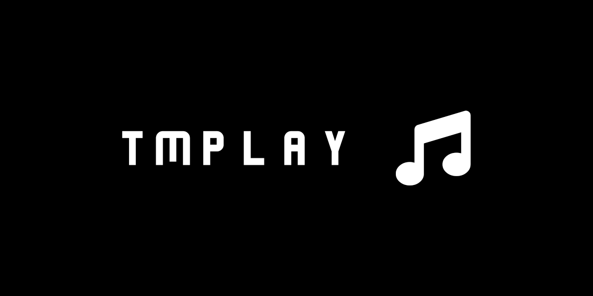

# tmplay

A minimalist terminal music player.

## Getting Started

>[!NOTE]
>This is a Windows-only program for now.

- Download and extract a release from the [releases](https://github.com/a22Dv/tmplay/releases) page of this repository.
- Click to run, or type in `./tmplay` on your terminal.

### Features

- Fully-featured TUI.
- Directory scanning at startup for new audio files.
- Minimalist, super lightweight audio player.
- Shuffling, looping, auto-play, and other core playback controls.
- Playlist creation via JSON file (in-app playlist modification will be implemented soon)

### To-Do

- [x] It plays music.
- [x] Core playback controls.
- [x] Core UI.
- [ ] Audio visualization.
- [ ] yt-dlp integration.
- [ ] In-app playlist management.
- [ ] Support audio file metadata.
- [ ] Global search.
- [ ] Cover art display.
- [ ] Basic track recommendation system.
- [ ] Audio fingerprinting, playback data tracking for recommendation.
- [ ] Full track recommendation system.
- [ ] "For You" section on the home page with recommended tracks.
- [ ] Setting to automate audio metadata gathering.
- [ ] Automated playlist creation using learned local playback data.

### Controls

Supports mouse input, keyboard navigation via arrow keys. Press Enter to select tracks or interact with buttons when using keyboard input.

>[!NOTE]
>LMB playback for the playlist track selection is going to be fixed soon. But for now press Enter to play a track after selecting it.

## License
This project is licensed under the MIT license - see LICENSE for more details.

## Author
a22Dv - a22dev.gl@gmail.com